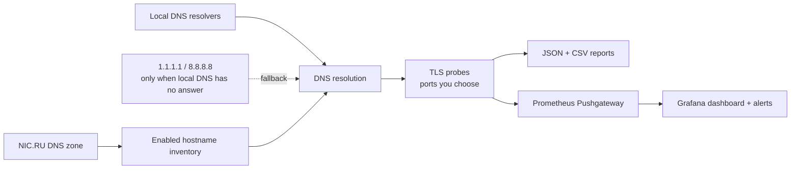

<div align="center">

# subssl

### Turn a DNS zone into a living TLS certificate inventory.

Scan what you actually operate. Catch expiry, broken TLS, and hostname-mismatch
problems before your users do.

[](https://github.com/Dpsley/subssl/actions/workflows/ci.yml)
[](https://github.com/Dpsley/subssl/releases)
[](https://www.python.org/)
[](#installation)
[](LICENSE)

[Get started](#quick-start) · [Install](#installation) · [Monitoring](#monitoring) · [Contribute](CONTRIBUTING.md)

</div>

> [!TIP]
> **subssl does not guess.** Your NIC.RU DNS zone is the source of truth, so
> scans stay useful, repeatable, and free of random internet-wide enumeration.

## Why subssl?

| What you need | What subssl gives you |
| --- | --- |
| Know every HTTPS endpoint you own | Imports the zone apex and direct, user-facing hostnames from NIC.RU |
| Find certificate trouble early | Checks expiry, issuer, hostname matching, and TLS connection failures |
| Respect internal DNS | Queries your local resolvers before falling back to public DNS |
| Keep evidence | Saves machine-readable JSON and CSV reports locally |
| Put TLS health on the wallboard | Publishes Prometheus metrics and includes Grafana and alert-rule assets |
| Run it without a web service | A focused terminal UI plus CLI and optional scheduled scans |

## How it works



## Quick start

```bash
git clone https://github.com/Dpsley/subssl.git
cd subssl
chmod +x install.sh
sudo ./install.sh
subssl
```

The first launch opens the terminal UI. Add your NIC.RU zone and read-only
credentials, select hostnames, configure local DNS if needed, and run a scan.

```bash
# Scan using the saved configuration
subssl scan -v

# Inspect configuration status without printing secrets
subssl status
```

## Installation

### Debian / Ubuntu

The installer creates an isolated runtime in `/opt/subssl` and exposes the
`subssl` command through `/usr/local/bin`. It does not modify shell profiles.

```bash
git clone https://github.com/Dpsley/subssl.git
cd subssl
sudo ./install.sh
```

To install only for the current user, omit `sudo`:

```bash
./install.sh
```

This puts the command in `~/.local/bin`. Add that directory to the startup file
for the shell you actually use if it is not already on `PATH`:

```bash
export PATH="$HOME/.local/bin:$PATH"
```

### Install a release package

Every commit pushed to `main` is built on GitHub Actions and published as a
GitHub Release with a `.deb` attachment. Download the current package from
[Releases](https://github.com/Dpsley/subssl/releases), then install it:

```bash
sudo apt install ./subssl_2.2.3_all.deb
```

### Install with pip

For development or a virtual-environment installation:

```bash
git clone https://github.com/Dpsley/subssl.git
cd subssl
python3 -m venv .venv
source .venv/bin/activate
python -m pip install --upgrade pip
python -m pip install .
subssl
```

### Build the Debian package yourself

On a Debian-compatible build host with `dpkg-deb` available:

```bash
./build-deb.sh
sudo apt install ./dist/subssl_2.2.3_all.deb
```

## First-run checklist

1. Run `subssl` to open the configuration UI.
2. In **NIC.RU / DNS zone settings**, add the zone name and NIC.RU OAuth
   application and account credentials.
3. Use the read-only scope `GET:/dns-master/.+` for the OAuth application.
4. Configure local DNS resolvers so private or split-horizon names resolve as
   they do in your network.
5. Review the **Hostnames** selection and start a scan.

subssl stores credentials only on the machine running it, in
`~/.config/subssl/secrets.json` with `0600` permissions. Reports are written to
`~/.local/state/subssl/reports/` by default.

## Monitoring

Set a Prometheus Pushgateway URL in **Automation & monitoring → Prometheus /
Grafana delivery**. After each scan, subssl publishes a complete TLS metrics
snapshot.

| Asset | Purpose |
| --- | --- |
| [`grafana/subssl-certificates-dashboard.json`](grafana/subssl-certificates-dashboard.json) | Importable dashboard for expiry, probe status, certificate details, and hostname mismatches |
| [`prometheus/subssl-alerts.yml`](prometheus/subssl-alerts.yml) | Warning and critical certificate-expiry alerts |

Prometheus must scrape the configured Pushgateway. The resulting metrics include
the hostname, domain, resolved endpoint, port, certificate dates, issuer type,
and safe TLS error information.

## Security and privacy

subssl works with credentials and can inventory internal names and addresses.
Treat its configuration directory and reports as sensitive operational data.

- Credentials, reports, local state, virtual environments, and build output are
  excluded by [`.gitignore`](.gitignore).
- Never paste tokens, internal hostnames, IP addresses, reports, or full config
  files into issues or pull requests.
- Report vulnerabilities privately using the [security policy](SECURITY.md).

## Project health

- Tests run on Python 3.10, 3.11, and 3.12 for every push and pull request.
- Release automation builds and attaches a Debian package after every push to
  `main`.
- Dependabot checks Python and GitHub Actions dependencies weekly.
- Bug reports and feature proposals have structured templates to keep triage
  fast and safe.

## Contributing

Issues and pull requests are welcome. Please read
[CONTRIBUTING.md](CONTRIBUTING.md) before opening one, especially the guidance
on removing sensitive operational data. By participating, you agree to the
[Code of Conduct](CODE_OF_CONDUCT.md).

## License

subssl is source-available and free to use, including for commercial and
internal use. Copyright and all ownership remain exclusively with Dpsley;
redistribution, modification, and derivative works require written permission.
See [LICENSE](LICENSE).
